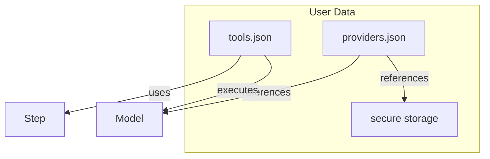

# pnife Architecture

## Overview

pnife is a local-first, extensible desktop app for configuring, running, and managing AI-powered text transformation pipelines ("Tools"). It supports user-defined LLM providers/models, secure API key storage, and real-time pipeline execution.

---

## Key Entities

### Provider

- Represents a service (OpenAI, Anthropic, LM Studio, Ollama, Google, etc)
- User-configurable (add/edit/remove)
- Stores non-sensitive info in config (name, type, available models)
- **Sensitive info (API keys, secrets) is stored securely using Tauri secure storage**
- Example:

```json
{
  "id": "openai",
  "name": "OpenAI",
  "type": "cloud",
  "models": [
    { "id": "gpt-3.5-turbo", "name": "GPT-3.5 Turbo" },
    { "id": "gpt-4", "name": "GPT-4" }
  ]
}
```

### Model

- Belongs to a Provider
- Used in Tool Steps of type "ai_prompt"
- Declares its capabilities (e.g., "llm:text", "llm:vision")
- Example:

```json
{
  "id": "gpt-4",
  "name": "GPT-4",
  "providerId": "openai",
  "capabilities": ["llm:text"]
}
```

```json
{
  "id": "gpt-4-vision",
  "name": "GPT-4 Vision",
  "providerId": "openai",
  "capabilities": ["llm:text", "llm:vision"]
}
```

### Tool

- User-editable pipeline, stored as JSON
- Composed of ordered Steps (linear, no branching for now)
- Example:

```json
{
  "id": "summarize",
  "name": "Summarize",
  "description": "Summarize selected text.",
  "steps": [{ "type": "ai_prompt", "prompt": "Summarize the following text" }]
}
```

### Step

- Each step has a `category` (e.g., "transformation"), a `type` (e.g., "ai_prompt", "regex_replace"), and a `requires` array of colon-scoped dependencies (e.g., "llm:text", "llm:vision").
- Future categories could include "file_op", "side_effect", etc.
- Example (AI prompt):

```json
{
  "category": "transformation",
  "type": "ai_prompt",
  "prompt": "Summarize the following text",
  "requires": ["llm:text"]
}
```

- Example (AI image):

```json
{
  "category": "transformation",
  "type": "ai_image",
  "prompt": "Generate an image of a banana.",
  "requires": ["llm:vision"]
}
```

- Example (Regex):

```json
{
  "category": "transformation",
  "type": "regex_replace",
  "pattern": "\\d+",
  "replacement": "#",
  "requires": []
}
```

---

## Secure Storage

- **API keys and provider secrets are never stored in plain JSON.**
- Use Tauri secure storage plugin to store/retrieve secrets at runtime.
- Provider config references a key (e.g., `apiKeyId`) used to fetch the secret.
- Example Provider config:

```json
{
  "id": "openai",
  "name": "OpenAI",
  "type": "cloud",
  "models": [...],
  "apiKeyId": "openai-main-key"
}
```

---

## Pipeline Context

Each pipeline execution passes a mutable `context` object through all steps. This object holds:

- The initial user input
- The output of each completed step (with step index/type info)
- Metadata (timestamps, selected model/provider, etc)
- If a step fails, the pipeline stops and the error is recorded at the context level (not per step)

### Example Context Schema

```json
{
  "input": "Original user text...",
  "steps": [
    {
      "index": 0,
      "type": "ai_prompt",
      "output": "Summarized text..."
    }
    // If a step fails, this array ends here
  ],
  "finalOutput": "Summarized text...", // or last successful output
  "error": null, // or error object if failed
  "meta": {
    "providerId": "openai",
    "modelId": "gpt-4",
    "startedAt": "2026-03-13T12:00:00Z",
    "finishedAt": "2026-03-13T12:00:01Z"
  }
}
```

### Notes

- Each step can read/modify the context.
- If a step fails, the pipeline stops and the error is set at the context level.
- The schema is extensible for future needs (branching, side effects, etc).

---

## Pipeline Execution

- Synchronous, step-by-step
- Each step output is shown in real time (using the context object)
- Step-level error handling and reporting
- All data (tools, configs, history) stored locally (import/export supported)

---

## Step Dependencies & Capabilities

- Steps declare their required capabilities using colon-scoped strings (e.g., `llm:text`, `llm:vision`).
- Models/providers declare their capabilities.
- The UI and validation logic can:
  - Warn if a required capability is missing from the selected model/provider.
  - Filter available models/providers based on step requirements.
  - Guide users to set up missing dependencies.

---

## Extensibility

- Future: branching, async/parallel steps, more step types (file ops, shell, etc), cloud sync

---

## Privacy & Security

- All user data is local by default
- API keys and secrets are encrypted at rest
- No data is sent externally except to user-configured providers

---

## Example File Structure

- `tools.json` — user tools/pipelines
- `providers.json` — provider configs (no secrets)
- `secure storage` — API keys/secrets (via Tauri plugin)

---

## Diagram



---

## Notes

- All configs are designed for easy import/export and future cloud sync.
- Secure storage is required for any sensitive provider info.
